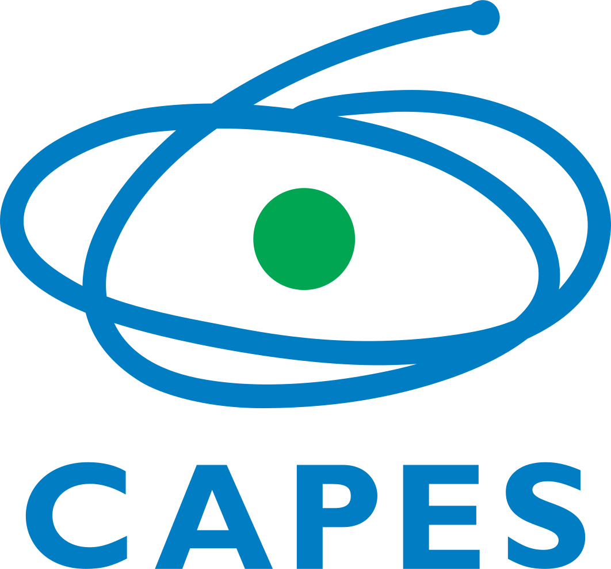

# abnt <a href = "https://github.com/danielvartan/abnt"></a>

<!-- badges: start -->
[](https://www.repostatus.org/#active)
[](https://doi.org/10.5281/zenodo.18357083)
[](https://github.com/danielvartan/abnt/actions)
[](https://fairsoftwarechecklist.net/v0.2?f=21&a=32113&i=02300&r=123)
[](https://fair-software.eu)
[](https://www.gnu.org/licenses/gpl-3.0)
[](https://creativecommons.org/licenses/by-nc-sa/4.0/)
[](https://www.contributor-covenant.org/version/3/0/code_of_conduct/)
<!-- badges: end -->

## Overview

`abnt` is a [Quarto](https://quarto.org) format designed for creating theses and dissertations that comply with guidelines established by the Brazilian Association of Technical Standards ([ABNT](https://www.abnt.org.br/)). It's based on the [`abntex2`](https://www.abntex.net.br/) LaTeX class, which belongs to the [`memoir`](https://www.ctan.org/pkg/memoir) class family.

Click [here](https://danielvartan.github.io/abnt/) to view the format output. For a real-world application, see [this example](https://github.com/danielvartan/mastersthesis).

> If you find this project useful, please consider giving it a star! &nbsp; [](https://github.com/danielvartan/abnt)

> The continuous development of `abnt` depends on community support. If you can afford to do so, please consider becoming a sponsor. &nbsp; [](https://github.com/sponsors/danielvartan)


## Prerequisites

To effectively use `abnt`, you must have some familiarity with the tools and languages involved. This includes the [R programming language](https://www.r-project.org), the [TeX](https://tug.org) and [LaTeX](https://www.latex-project.org) typesetting system, the [Quarto](https://quarto.org) publishing system, and the [abntex2](https://www.abntex.net.br), [memoir](https://www.ctan.org/pkg/memoir), and [biblatex](https://www.ctan.org/pkg/biblatex) TeX packages.

While this format allows integration of other programming languages, its core structure is based on [R](https://www.r-project.org) and [TeX](https://tug.org). Any customizations will require working within these languages. I also recommend using the free and open-source reference manager [Zotero](https://www.zotero.org).

If you're less familiar with R, I suggest exploring resources such as Hadley Wickham and Garrett Grolemund's online book [R for Data Science](https://r4ds.had.co.nz) or the Coursera course from Johns Hopkins University, [Data Science: Foundations using R](https://www.coursera.org/specializations/data-science-foundations-r) (free for audit students).

To learn [LaTeX](https://www.latex-project.org), I suggest Tobias Oetiker et al.'s online book [The Not So Short Introduction to LaTeX](https://tobi.oetiker.ch/lshort/lshort.pdf). Other excellent free resources include [Learn LaTeX.org](https://www.learnlatex.org/en) and Winston Chang's [LaTeX Cheat Sheet](http://wch.github.io/latexsheet/).

Access to the ABNT standards could also help. It's important to note that the standards are not publicly accessible. If you are affiliated with a federal or state university in Brazil, you may have access to [Target GEDWeb](https://www.gedweb.com.br), a service for managing standards and other regulatory documents. Members of the University of São Paulo ([USP](https://www5.usp.br/)) can access ABNT standards on GEDWeb [here](https://uspdigital.usp.br/wsusuario/gedweb.jsp).

## Installation

This format requires [Quarto](https://quarto.org) 1.8.27 or later, [R](https://www.r-project.org/) 4.5.2 or later, and a [LaTeX](https://www.latex-project.org/) distribution with the [`lualatex`](https://www.luatex.org/) engine. For quick LaTeX installation, use [TinyTeX](https://yihui.org/tinytex/), which can be installed from R via the [`tinytex`](https://yihui.org/tinytex/) package.

The typefaces [Noto Sans](https://fonts.google.com/noto/specimen/Noto+Sans) and [Noto Sans Mono](https://fonts.google.com/noto/specimen/Noto+Sans+Mono) are used as the main and monospace default fonts, respectively. If you plan to maintain the default settings, install both fonts on your system. These are developed by Google and are freely available under the [SIL Open Font License](https://openfontlicense.org/).

While [Quarto](https://quarto.org) provides various customization features, they don't fully address [ABNT](https://www.abnt.org.br/) standards. Some formatting adjustments required unconventional methods and multiple processing layers. The easiest way to start using `abnt` is to copy or [clone](https://github.com/git-guides/git-clone) this repository and build upon its [Quarto book](https://quarto.org/docs/books/).

After copying/cloning the repository, install the [`renv`](https://rstudio.github.io/renv/index.html) R package and run [`renv::restore()`](https://rstudio.github.io/renv/reference/restore.html) to ensure all necessary dependencies are installed. This process is usually done automatically when opening the project in [Positron](https://positron.posit.co/) or [RStudio](https://posit.co/download/rstudio-desktop/). If you're having issues with `renv` (it can be [a little frustrating](https://youtu.be/l01u7Ue9pIQ?si=S44LlHVSufGJ4zdq)), use [`renv::deactivate(clean = TRUE)`](https://rstudio.github.io/renv/reference/activate.html) to completely remove the environment and start fresh.

I plan to implement this format more straightforwardly using [Lua filters](https://quarto.org/docs/extensions/filters.html) to directly manipulate the LaTeX code generated by [Pandoc](https://pandoc.org/lua-filters.html). This approach should simplify the structure and reduce the number of processing layers required, but there is currently no fixed timeline for this implementation. If you are interested in contributing to this effort, please refer to the [*Contributing*](#contributing) section.

## Usage

Most customization options available in the Quarto system are compatible with this format. See the `abnt` [PDF output](https://danielvartan.github.io/abnt/) *Settings* annex for details. If you have questions or need assistance, use the project's GitHub [discussion tab](https://github.com/danielvartan/abnt/discussions).

The *Showcase* sections contain numerous examples demonstrating potential applications. However, it's best to remove them when starting a new project, as they require several additional packages and configurations that may not be necessary for your specific use case. After removing the *Showcase* examples, run [`renv::snapshot()`](https://rstudio.github.io/renv/reference/snapshot.html) to update the project's dependency list accordingly. I also recommend removing the `.github/workflows/quarto-render.yaml` file unless you plan to use GitHub Actions for continuous integration.

For additional customization details, refer to the [PDF Options](https://quarto.org/docs/reference/formats/pdf.html) section in the Quarto guide and the [extension YAML file](_extensions/abnt/_extension.yml).

The rendering process is the same for any Quarto project. To render the document, run the following command in your terminal within the project directory:

```bash
quarto render
```

Alternatively, you can utilize the [`quarto`](https://quarto-dev.github.io/quarto-r/) R package's [`quarto_render()`](https://quarto-dev.github.io/quarto-r/reference/quarto_render.html) function as an interface.

## Citation

[](https://doi.org/10.5281/zenodo.18357083)

If you use `abnt` in your work, please cite it to acknowledge the time and effort invested in its development and maintenance. Your citation helps support the ongoing improvement of the project.

To cite `abnt` in publications please use the following format:

Vartanian, D. (n.d.). *abnt: Quarto format for ABNT theses and dissertations* [Computer software]. <https://doi.org/10.5281/zenodo.18357083>

A BibLaTeX entry for LaTeX users is:

```latex
@software{vartanian,
  title = {abnt: Quarto format for ABNT theses and dissertations},
  author = {Daniel Vartanian},
  url = {https://github.com/danielvartan/abnt},
  doi = {10.5281/zenodo.18357083}
}
```

## Contributing

[](https://www.contributor-covenant.org/version/3/0/code_of_conduct/)

Contributions are always welcome! Whether you want to report bugs, suggest new features, or help improve the code or documentation, your input makes a difference.

Before opening a new issue, please check the [issues tab](https://github.com/danielvartan/abnt/issues) to see if your topic has already been reported.

[](https://github.com/sponsors/danielvartan)

You can also support the development of `abnt` by becoming a sponsor.

Click [here](https://github.com/sponsors/danielvartan) to make a donation. Please mention `abnt` in your donation message.

## License

[](https://www.gnu.org/licenses/gpl-3.0)
[](https://creativecommons.org/licenses/by-nc-sa/4.0/)

The code in this repository is licensed under the [GNU General Public License Version 3](https://www.gnu.org/licenses/gpl-3.0), while the documents are available under the [Creative Commons Attribution-NonCommercial-ShareAlike 4.0 International](https://creativecommons.org/licenses/by-nc-sa/4.0/).

```text
Copyright (C) 2026 Daniel Vartanian

abnt is free software: you can redistribute it and/or modify it
under the terms of the GNU General Public License as published by the Free
Software Foundation, either version 3 of the License, or (at your option) any
later version.

This program is distributed in the hope that it will be useful, but WITHOUT ANY
WARRANTY; without even the implied warranty of MERCHANTABILITY or FITNESS FOR A
PARTICULAR PURPOSE. See the GNU General Public License for more details.

You should have received a copy of the GNU General Public License along with
this program. If not, see <https://www.gnu.org/licenses/>.
```

## Acknowledgments

`abnt` is an independent project with no affiliation to the Brazilian Association of Technical Standards ([ABNT](https://www.abnt.org.br/)).

This project owes its existence to the contributions of dedicated developers from the [`abntTeX`](https://www.abntex.net.br/) community.

`abnt` brand identity is based on the [ABNT](https://www.abnt.org.br/) brand identity.

<table>
  <tr>
    <td width="30%" align="center" valign="center">
      <a href="https://www.fsp.usp.br/sustentarea/"></a>
    </td>
    <td width="70%" valign="center">
      This work was developed with support from the Graduate Program in Modeling
      Complex Systems (<a href="https://www.prpg.usp.br/pt-br/faca-pos-na-usp/programas-de-pos-graduacao/621-modelagem-de-sistemas-complexos">PPGSCX</a>) at the University of São Paulo (<a href="https://usp.br/">USP</a>).
    </td>
  </tr>
</table>

<table>
  <tr>
    <td width="30%" align="center" valign="center">
      <a href="https://fapesp.br/"></a>
    </td>
    <td width="70%" valign="center">
      This work was financed, in part, by the Coordination for the Improvement of Higher Education Personnel (<a href="https://www.gov.br/capes/">CAPES</a>), Brazil. Process Number 88887.703720/2022-00.
    </td>
  </tr>
</table>
